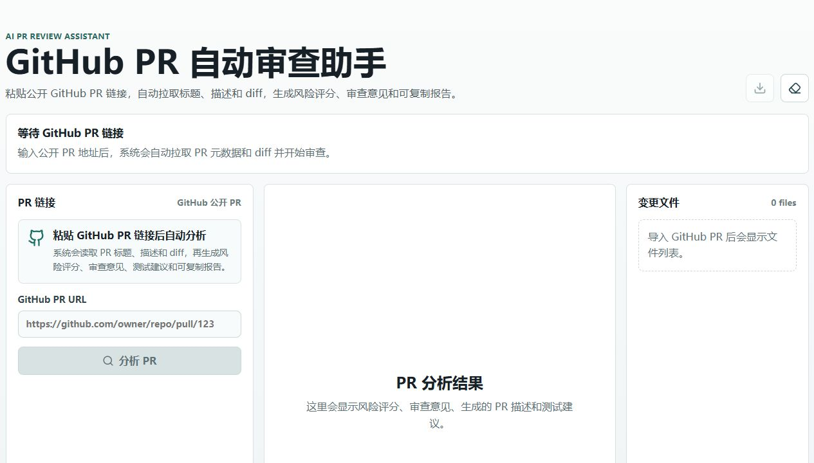
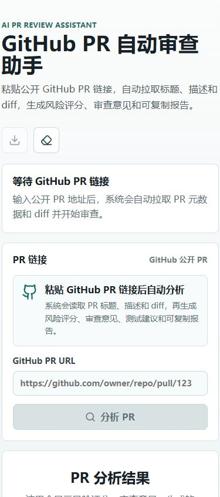

# AI PR Review Assistant

AI PR Review Assistant 是一个面向 GitHub Pull Request 的自动审查助手。用户粘贴公开 GitHub PR 链接后，系统会自动拉取 PR 标题、描述和 diff，生成结构化风险评分、审查意见、AI 代码质量评价和可导出 Review 报告。

项目同时提供网页端和浏览器插件版本：

- 网页端：输入 GitHub PR URL，一键分析公开 PR。
- 浏览器插件：直接在 GitHub PR 页面注入分析面板。

## Demo

- 公开仓库：[the-shy123456/AI-RP-REVIEW](https://github.com/the-shy123456/AI-RP-REVIEW)
- Demo 视频：[demo.mp4](https://github.com/the-shy123456/AI-RP-REVIEW/releases/download/demo-video/demo.mp4)

## 界面预览



移动端布局：



## 核心功能

- GitHub PR 链接导入：通过 GitHub API 自动读取公开 PR 的标题、描述和 diff。
- PR 风险评分：根据内置规则和变更规模生成 0-100 风险分。
- 结构化审查意见：覆盖安全、测试、可靠性、可维护性和流程规范。
- AI 代码质量评审：大模型阅读 PR diff，评价代码质量、漏洞风险、测试充分性、考虑是否周到，并给出合并建议。
- 变更文件解析：从 PR diff 中识别文件状态、增删行数量。
- Markdown 报告导出：可下载 Review 结果作为评审记录或 PR 评论草稿。
- 浏览器插件：在 GitHub PR 页面内直接分析当前 PR。

## 当前规则

规则引擎负责快速筛查确定性风险：

- 缺少可审查的 diff 内容。
- PR 标题格式不清晰。
- 访问令牌疑似暴露在前端存储或请求体中。
- 未净化 HTML 注入点，例如 `dangerouslySetInnerHTML` / `innerHTML`。
- 删除测试文件。
- 异步 loading 状态缺少 `finally` 兜底。
- 生产路径残留 `console.error` / `console.log` / `console.warn`。
- PR 描述过短。
- 功能变更没有对应测试变更。
- PR 规模偏大，建议拆分。

## AI 代码评审

AI 代码评审负责规则难以覆盖的主观质量判断：

- 是否存在潜在漏洞、输入校验不足、权限或数据泄露风险。
- 代码是否整洁、命名是否清楚、职责是否单一、复杂度是否合理。
- 变更是否考虑周到，包括错误处理、边界条件、加载状态和兼容性。
- 功能是否完整，是否存在只覆盖 happy path 的情况。
- 测试是否充分，是否覆盖失败路径和关键边界。
- 是否建议合并：建议合并、有条件合并、建议修改后再合并。

## 原创功能范围

本项目原创实现：

- GitHub PR URL 解析、PR 元数据与 diff 拉取逻辑。
- `src/lib/reviewEngine.ts` 中的 diff 解析、风险规则、评分模型和文案生成逻辑。
- React PR 分析界面与信息架构。
- Manifest V3 GitHub PR 页面分析插件。
- 面向参赛 PR 规范的过程风险识别规则。

第三方库用于工程搭建、UI 图标、测试和构建，不包含核心 Review 规则模型。

## 技术栈与依赖

- React 18.3.1：前端视图框架。
- TypeScript 5.7.3：类型约束和可维护性保障。
- Vite 5.4.14：开发服务器与构建工具。
- Vitest 2.1.8：单元测试框架。
- ESLint 9.19.0：代码规范检查。
- lucide-react 0.475.0：按钮与模块图标。
- Chrome/Edge Manifest V3：浏览器插件版本。
- OpenAI-compatible Chat Completions / OpenAI Responses API：AI 代码质量评审。

完整依赖版本以 `package.json` 和 `package-lock.json` 为准。

## 本地运行

```bash
npm install
npm run dev
```

默认访问：

```text
http://127.0.0.1:5173
```

开发模式下 `npm run dev` 已经内置 `/api/ai-review`，页面里的 AI 代码评审可以直接使用。

如果需要把 AI Review API 作为独立服务运行，可以另开终端启动：

```bash
npm run dev:api
```

默认后端地址：

```text
http://127.0.0.1:8787/api/ai-review
```

在页面“大模型配置”里填写：

- `协议`：选择 `Chat Completions` 或 `OpenAI Responses`。
- `BASE_URL`：第三方大模型 OpenAI-compatible 地址，例如 `https://api.openai.com/v1`、`https://api.deepseek.com/v1`。
- `API_KEY`：对应平台的 API Key。
- `MODEL`：模型名，例如 `gpt-4o-mini`、`deepseek-chat`、`qwen-plus`。

如果 GitHub 匿名 API 返回 403，可以在“PR 链接”区域点击“登录 GitHub”走 OAuth 授权。授权 token 由后端写入 `HttpOnly` 会话 Cookie，前端只保存“已授权”状态，用于读取 PR metadata 和 diff。

GitHub 登录是标准 OAuth 流程：终端用户只点击“登录 GitHub”，然后跳转到 GitHub 用自己的账号授权。下面两个值是部署者在 GitHub OAuth App 后台登记本应用时获得的服务端配置，不是给终端用户填写的账号信息。

本地开发需要先在 GitHub OAuth App 中配置回调地址：

```text
http://127.0.0.1:5173/api/github-auth/callback
```

然后设置：

```bash
$env:GITHUB_CLIENT_ID="你的 GitHub OAuth Client ID"
$env:GITHUB_CLIENT_SECRET="你的 GitHub OAuth Client Secret"
npm run dev
```

也可以复制 `.env.example` 为 `.env.local` 后填入同样的配置。未配置时，登录入口会提示“GitHub 登录暂未启用”；配置后点击按钮会直接跳转 GitHub 登录/授权页面。

也可以在后端环境变量中配置 `GITHUB_TOKEN` 作为服务端默认授权。

协议说明：

- `Chat Completions`：调用 `{BASE_URL}/chat/completions`，适合 DeepSeek、通义千问等 OpenAI-compatible 第三方服务。
- `OpenAI Responses`：调用 `{BASE_URL}/responses`，适合支持 OpenAI Responses API 和 JSON Schema 结构化输出的模型服务。

也可以用后端环境变量作为默认值：

```bash
$env:OPENAI_BASE_URL="https://api.openai.com/v1"
$env:OPENAI_API_KEY="你的 API Key"
$env:OPENAI_MODEL="gpt-4o-mini"
$env:OPENAI_PROTOCOL="responses"
npm run dev
```

## 使用方式

1. 打开网页端。
2. 粘贴公开 GitHub PR 链接，例如：

```text
https://github.com/owner/repo/pull/123
```

3. 点击“分析 PR”。
4. 查看风险评分、审查意见、AI 代码评审和变更文件统计。
5. 在“大模型配置”中选择协议并填写 `BASE_URL`、`API_KEY`、`MODEL` 后，点击“AI 代码评审”获取代码质量评价和合并建议。
6. 导出 Markdown Review 报告。

## 浏览器插件

插件目录：`extension/`

加载方式见 [docs/EXTENSION.md](docs/EXTENSION.md)。

## 质量验证

```bash
npm run test
npm run build
npm run lint
```

## 推荐 PR 拆分路线

为满足“全周期持续交付”和“小粒度 PR”要求，建议按真实开发时间持续提交，不要最后一天一次性导入代码。

1. PR 1：项目脚手架、README 初稿、PR 模板。
2. PR 2：GitHub PR URL 解析与导入。
3. PR 3：diff 解析与变更文件统计。
4. PR 4：风险规则引擎与评分模型。
5. PR 5：PR 链接分析界面。
6. PR 6：浏览器插件 GitHub 页面注入。
7. PR 7：报告复制/导出、单元测试和文档。
8. PR 8：Demo 视频链接、部署链接和最终文档润色。

每个 PR 都应包含清晰标题、功能描述、实现思路和测试方式。

## 参赛交付清单

- [ ] 公开 GitHub/Gitee 仓库。
- [ ] commit 时间戳在所选批次开始与截止时间之内。
- [ ] 保持持续 PR 和 commit 记录。
- [ ] 所有 PR 描述不为空且与代码变更一致。
- [ ] README 列明第三方依赖与原创功能范围。
- [ ] Demo 视频可公开访问，并在 README 中提供链接。
- [ ] 主分支任意时间保持可运行。

## 项目文档

- `docs/PRD.md`：需求与验收标准。
- `docs/ARCHITECTURE.md`：架构设计与扩展点。
- `docs/REVIEW_RULES.md`：内置审查规则说明。
- `docs/EXTENSION.md`：浏览器插件使用说明。
- `docs/DELIVERY_PLAN.md`：建议 PR 拆分与持续交付节奏。
- `docs/DEPLOYMENT.md`：部署与公开演示地址配置。
- `docs/REPOSITORY_SETUP.md`：公开仓库与真实 PR 流程说明。
- `docs/DEMO_SCRIPT.md`：Demo 视频讲解脚本。

## 后续规划

- 支持 GitHub Enterprise 和更细粒度仓库授权。
- 支持 GitHub Enterprise 和 Gitee PR。
- 支持团队自定义规则集。
- 支持把 AI Review 结果自动发布为 GitHub PR 评论。
