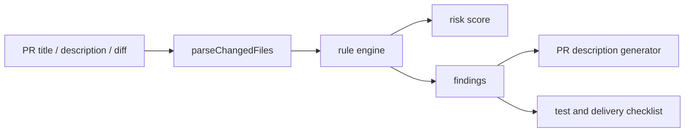

# Architecture

## Overview

AI PR Review Assistant 是一个单页前端工作台。系统分为三层：

1. 输入层：收集 PR 标题、描述和 git diff。
2. Review 引擎层：解析 diff，运行规则，生成评分和文案。
3. 展示层：呈现风险指标、审查意见、PR 描述和交付检查。



## Review Engine

`src/lib/reviewEngine.ts` 暴露两个主要函数：

- `parseChangedFiles(diff)`：解析 git diff 中的文件路径、状态和增删行。
- `analyzePullRequest(input)`：生成完整 `ReviewReport`。

规则结构：

```ts
type Rule = {
  id: string;
  severity: Severity;
  category: ReviewCategory;
  title: string;
  test: (input: ReviewInput, files: ChangedFile[]) => string | null;
  recommendation: string;
};
```

新增规则时只需要追加 `rules` 数组，并补充对应测试。

## Frontend

`src/App.tsx` 使用本地状态保存用户输入，通过 `useMemo` 调用 Review 引擎。页面分为：

- 顶部指标区：风险等级、风险分、变更文件数、审查点数。
- 左侧输入区：标题、描述、diff。
- 中央报告区：审查意见、生成的 PR 描述、测试与交付。
- 右侧变更文件区：文件状态和增删行。

## Future Extensions

- URL 导入：通过后端代理获取 GitHub/Gitee PR diff。
- LLM 增强：将规则命中结果发送给模型生成上下文修复建议。
- 团队规则：支持导入 YAML/JSON 自定义规则集。
- 报告导出：一键生成 Markdown Review 评论。
