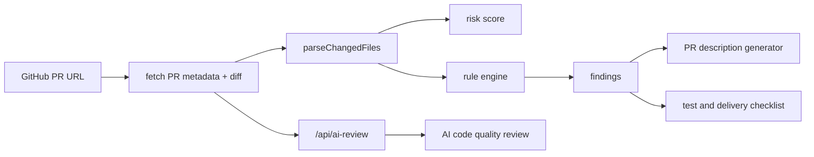

# Architecture

## Overview

AI PR Review Assistant 是一个 GitHub PR 链接驱动的自动审查工具。系统分为四层：

1. PR 导入层：解析 GitHub PR URL，拉取 PR 元数据和 diff。
2. 规则 Review 层：解析 diff，运行规则，生成评分和文案。
3. AI Review 层：后端调用 OpenAI Responses API，对 diff 进行代码质量评审。
4. 展示层：呈现风险指标、审查意见、AI 代码评审、PR 描述和交付检查。
5. 插件层：在 GitHub PR 页面内注入分析面板。



## Review Engine

`src/lib/reviewEngine.ts` 暴露两个主要函数：

- `parseChangedFiles(diff)`：解析 git diff 中的文件路径、状态和增删行。
- `analyzePullRequest(input)`：生成完整 `ReviewReport`。

规则结构：

```ts
type Rule = {
  id: string;
  severity: Severity;
  category: ReviewCategory;
  title: string;
  test: (input: ReviewInput, files: ChangedFile[]) => string | null;
  recommendation: string;
};
```

新增规则时只需要追加 `rules` 数组，并补充对应测试。

## GitHub Import

`src/lib/githubPullRequest.ts` 负责：

- `parseGitHubPullRequestUrl(url)`：校验并解析 GitHub PR URL。
- `fetchGitHubPullRequest(ref)`：通过 GitHub API 读取 PR metadata 和 diff media type。
- `importGitHubPullRequest(url)`：组合解析和拉取流程，返回 `ReviewInput`。

## Frontend

`src/App.tsx` 保存当前 PR URL、导入状态和分析结果，通过 GitHub 导入模块获取 PR 内容，再调用 Review 引擎。页面分为：

- 顶部指标区：风险等级、风险分、变更文件数、审查点数。
- 左侧导入区：GitHub PR URL、导入状态、当前 PR 链接。
- 中央报告区：审查意见、生成的 PR 描述、测试与交付。
- 右侧变更文件区：文件状态和增删行。

## Browser Extension

`extension/` 提供 Manifest V3 插件：

- `manifest.json`：声明 GitHub 页面 content script。
- `content.js`：在 GitHub PR 页面读取当前 URL、拉取 PR、运行规则并渲染结果。
- `content.css`：插件面板样式。

## AI Review API

AI 代码评审通过后端接口完成：

- `server/aiReviewCore.mjs`：构造大模型评审 prompt、调用 OpenAI Responses API、解析结构化 JSON。
- `server/aiReviewServer.mjs`：本地开发 API 服务。
- `api/ai-review.js`：Vercel 部署入口。

前端只调用 `/api/ai-review`，不会读取或暴露 `OPENAI_API_KEY`。

## Future Extensions

- GitHub Token 配置：提高公开 API rate limit。
- Gitee 支持：增加 Gitee PR URL 解析与 diff 拉取。
- LLM 增强：将规则命中结果发送给模型生成上下文修复建议。
- 团队规则：支持导入 YAML/JSON 自定义规则集。
